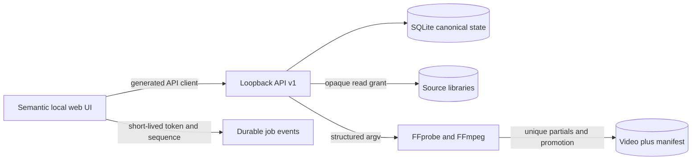

# Architecture

The backend is the only business-rule authority. It owns grants, scan generations, evidence/resolution ledgers, logical-source identity, project revisions, synchronization math, video/audio compilation, issues, immutable plans, review binding, source hashes, rendering, artifacts, events, migrations, and recovery. The frontend presents provisional interaction feedback and submits named commands; it reloads canonical results after every mutation.

Project preparation uses two backend-owned editorial clocks. Clip alignment maps
source-relative time to `alignedTimeUs`, the complete selected-evidence timeline.
Explicit keep/exclude/slate sections then map aligned time to `programTimeUs`.
Program Video and Audio do not exist until alignment review authorizes a bound
program-draft command. Libraries contain independently granted roots; immutable
catalog and cluster generations feed exact project selection snapshots. See ADRs
0004 through 0006.

Distribution is one Python wheel. Hatchling maps `web/` and `contracts/` into the `room_alignment` package at build time, so installed runtime never depends on repository-relative files. `room-alignment` and `python -m room_alignment` share one CLI dispatcher for service launch, dependency/resource diagnosis, and canonical-state administration. Source-checkout resource fallback exists only for development compatibility.

## Fixed semantics

- `MediaAsset` is one file; `LogicalSource` is a user-confirmed viewpoint containing one or more `ProjectClip` records. Candidate/label evidence is proposed in event-sized groups and becomes source identity only after explicit confirmation; every grouping remains reversible through split/reassign/merge commands.
- Native stream timing, source-relative time, and project-output time are distinct. Persisted editorial time is integer microseconds; intervals are half-open.
- Each clip has a deterministic bounded affine transform. Rate correction is limited to ±2,000 ppm, never silently clamped, and explicitly confirmed/disclosed.
- Logical video/audio blocks compile to exact asset/stream/source ranges. Renderability requires exactly one video and one audio decision (or explicit synthetic silence) per output interval.
- Suggestions are evidence-bearing, revision-bound records and cannot mutate a project until accepted as a project command.
- Application settings live in canonical SQLite state. The configured overlap-search extension expands candidate interval discovery and correlation lag bounds symmetrically; pair-count and per-clip caps remain fixed backpressure. Changing this analysis setting stales pending proposal sets, while appearance-only changes do not revise projects or render plans.
- Align previews are authenticated range reads beneath the current source grant. Up to six visible videos seek from the same canonical output clock; only the selected source is audible.
- Render plans are immutable and full-hash selected sources. Review binds plan/project/provenance/source-set/warnings. Relevant changes stale review.
- Artifact completion means both final video and final manifest exist and recorded digests were persisted; startup reconciles partial/pair crashes as recoverable failures.

## Chosen implementation

Python standard library minimizes runtime setup; SQLite supplies local transactions, backup, WAL, and single-file portability; vanilla JS keeps the generated API boundary visible; FFmpeg provides maintained broad media support. These are replaceable implementation choices. The OpenAPI/JSON Schema, integer time, commands, job states, manifest truth, and safety behavior are the compatibility boundary.

One process owns a state directory through a non-blocking OS file lock. Scans probe with bounded worker/queue counts. At most two analysis jobs, one full-hash render-plan creation, and one render are active concurrently; excess work receives stable `JOB_STATE_CONFLICT` backpressure. Alignment candidate generation remains capped at eight comparisons per clip and 2,000 comparisons per job even when the user expands timestamp search to its 300-second maximum. Event history retains at most 100,000 recent events; derived cache policy is at most 10,000 entries/2 GiB, evicting only registered unpinned files beneath the state cache root.
