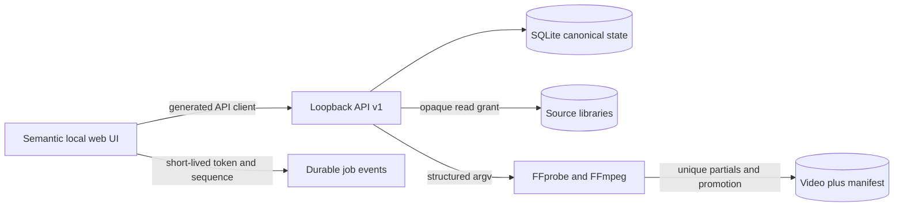

# Architecture

The backend is the only business-rule authority. It owns grants, scan generations, evidence/resolution ledgers, logical-source identity, project revisions, synchronization math, video/audio compilation, issues, immutable plans, review binding, source hashes, rendering, artifacts, events, migrations, and recovery. The frontend presents provisional interaction feedback and submits named commands; it reloads canonical results after every mutation.

## Fixed semantics

- `MediaAsset` is one file; `LogicalSource` is a user-confirmed viewpoint containing one or more `ProjectClip` records. Candidate labels never silently merge sources.
- Native stream timing, source-relative time, and project-output time are distinct. Persisted editorial time is integer microseconds; intervals are half-open.
- Each clip has a deterministic bounded affine transform. Rate correction is limited to ±2,000 ppm, never silently clamped, and explicitly confirmed/disclosed.
- Logical video/audio blocks compile to exact asset/stream/source ranges. Renderability requires exactly one video and one audio decision (or explicit synthetic silence) per output interval.
- Suggestions are evidence-bearing, revision-bound records and cannot mutate a project until accepted as a project command.
- Render plans are immutable and full-hash selected sources. Review binds plan/project/provenance/source-set/warnings. Relevant changes stale review.
- Artifact completion means both final video and final manifest exist and recorded digests were persisted; startup reconciles partial/pair crashes as recoverable failures.

## Chosen implementation

Python standard library minimizes runtime setup; SQLite supplies local transactions, backup, WAL, and single-file portability; vanilla JS keeps the generated API boundary visible; FFmpeg provides maintained broad media support. These are replaceable implementation choices. The OpenAPI/JSON Schema, integer time, commands, job states, manifest truth, and safety behavior are the compatibility boundary.

One process owns a state directory through a non-blocking OS file lock. Scans probe with bounded worker/queue counts. Renders supervise one owned process tree per job. Event history retains at most 100,000 recent events; derived cache policy is at most 10,000 entries/2 GiB, evicting only registered unpinned files beneath the state cache root.
