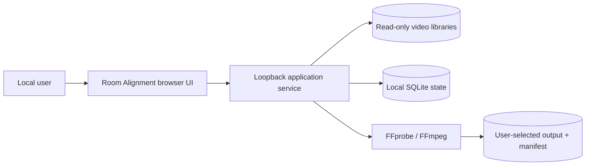

# Architecture

## Context

No cloud service or account exists. Loopback service is only application trust boundary.

## Containers

- `web/`: dependency-free semantic HTML, CSS, and JavaScript implementing accepted Library → Align → Cut → Review product flow.
- `room_alignment/server.py`: loopback HTTP API and static delivery.
- `room_alignment/scanner.py`: recursive, symlink-safe video discovery and FFprobe extraction.
- `room_alignment/provenance.py`: permissive evidence inference and confidence-based merge.
- `room_alignment/store.py`: SQLite persistence with WAL and foreign keys.
- `room_alignment/render.py`: preflight, manifest, FFmpeg planning, supervised jobs, cancellation, and atomic output promotion.

## Key contracts

1. Source media remains immutable.
2. Provenance evidence is appendable and conflicting evidence remains inspectable.
3. Alignment, editorial decisions, and render transforms are separate layers.
4. Program Video is contiguous and has exactly one selected source per valid interval.
5. Program Audio may be linked, independent, or explicit silence.
6. Render requires valid coverage, source availability, and minimum provenance.
7. Output manifest describes source-relative identity and transformations without requiring vendor schema.

## Desktop packaging seam

HTTP API is deliberately narrow. Tauri, native WebView, or another desktop shell can replace browser launch and expose directory pickers without changing data/edit contracts. Native bridge must retain loopback-equivalent origin checks and read-only source capability.

