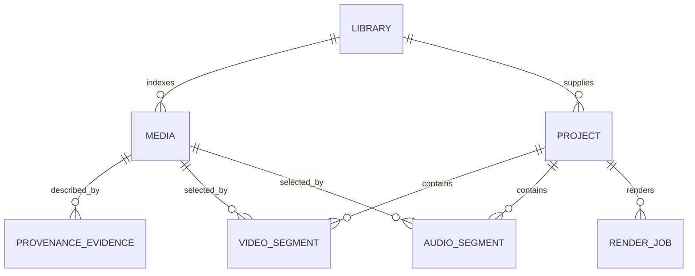

# Data model

`MediaRecord` stores stable library-relative ID, safe relative path, filesystem facts, container facts, optional captured time/camera/sequence, arbitrary custom fields, and all provenance evidence.

Each evidence entry records `kind`, `field`, `value`, confidence, and origin. Supported evidence kinds are filesystem, filename, container, sidecar, importer, and user. Missing and unfamiliar fields are valid.

Project document stores:

- source alignment map (`mediaId → label, offsetMs, reference`)
- cut anchoring mode (`wall-clock` or `source-clips`)
- Program Video segments
- Program Audio segments
- output timebase and optional wall-clock origin

Segment provenance carries source clip ID, source/editorial ranges, sync offset, evidence, custom metadata, and transforms.

